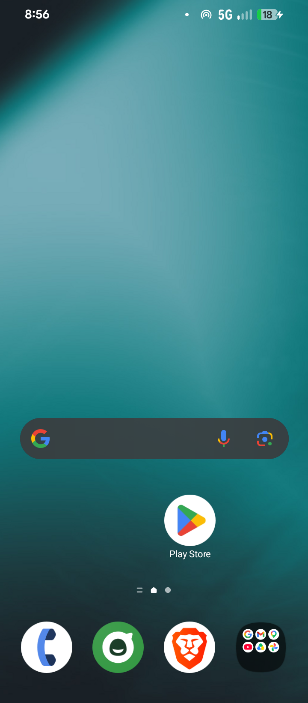
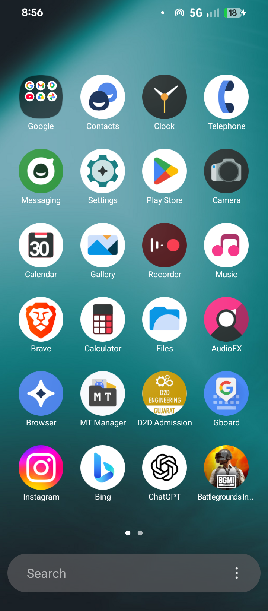
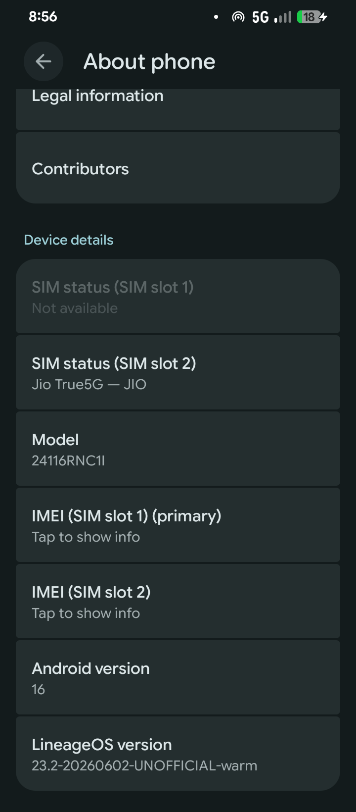

# One UI Home 36 Magisk Module (Fixed for Android 16)

## DISCLAIMER
- One UI apps and blobs are owned by Samsung™.
- The MIT license specified here is for the Magisk Module only, not for One UI apps and blobs.

## Descriptions
- Home launcher app by Samsung Electronics Co., Ltd. ported and integrated as a Magisk Module for all supported and rooted devices with Magisk.
- **Fixed for Android 16 (Baklava):** This version includes critical patches to support Android 16 gestural navigation and prevents initialization crashes.

## Android 16 Fixes (by Shyam Vadgama)
1. **Gesture Crash Fix:** Replaced deprecated `InputManager.getInstance()` with `Context.getSystemService("input")` to support the new Android 16 input subsystem.
2. **Kotlin Coroutines Restoration:** Fixed "OneUI Home keeps stopping" error by restoring missing Kotlin dispatcher service descriptors in `META-INF`.
3. **Compatibility & Installation:** Properly aligned (`zipalign`) and signed the APK to ensure it passes Android 11+ security checks for system/priv-apps.

## Screenshots (Working on Android 16)

## Requirements
- NOT in One UI nor Touchwiz ROM
- Android 15 (SDK 35) and up
- Android 16 (Baklava) fully supported
- Magisk or Kitsune Mask or KernelSU or Apatch installed
- One UI Core Magisk Module installed https://github.com/reiryuki/One-UI-Core-Magisk-Module

## Installation Guide
- Remove any previous One UI Home Magisk modules.
- Reboot.
- Install One UI Core Magisk Module first.
- Install this patched module.
- Reboot.
- Set OneUI Home as default launcher in Settings.

## Credits and Contributors
- @reiryuki (Original Creator)
- @KaldirimMuhendisi
- **Shyam Vadgama** (Android 16 Fixes & Maintenance)

## Support
- https://t.me/androidryukimodsdiscussions
